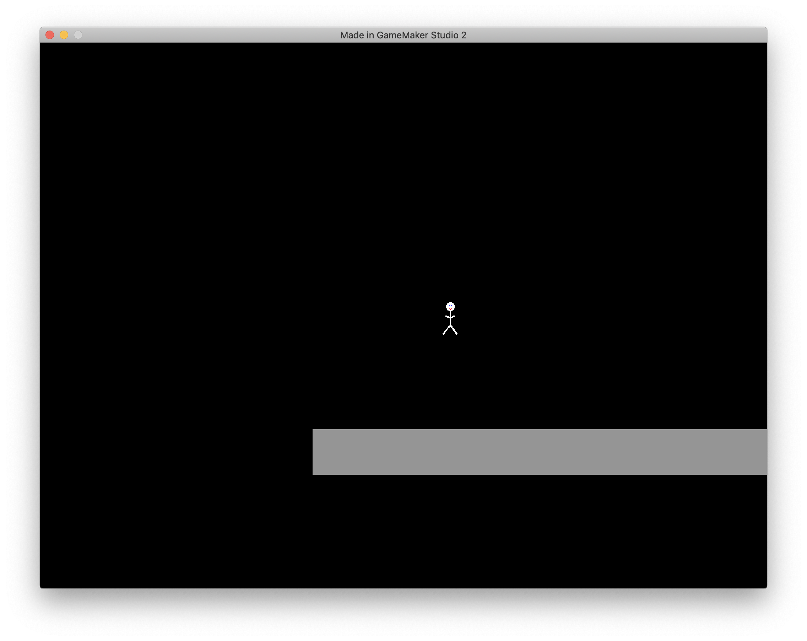
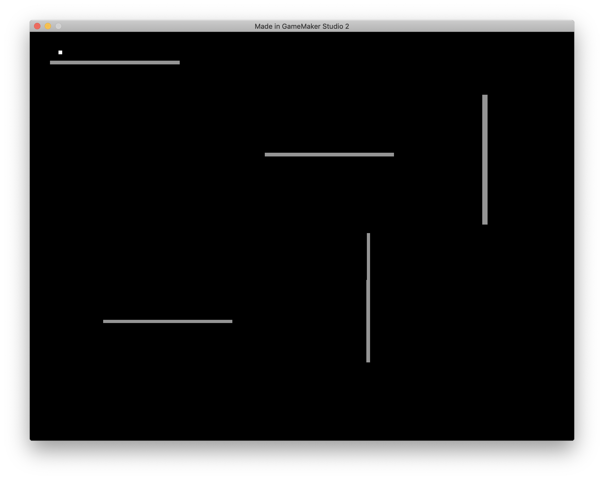

Simple game to demo how you can create two viewports: one for normal game play and the other for an overview map.

Press "M" to show overview map, otherwise use arrow keys to move player.

 
Normal view:
 

 

Overview map: (Note: The white dot is the player.)
 

